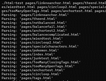
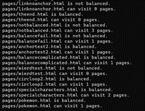

[Back to Portfolio](./)

 HTML Parser
===============

-   **Class: CSCI 315** 
-   **Grade: In Progress** 
-   **Language(s): C++** 
-   **Source Code Repository:** [features/mastering-markdown](https://guides.github.com/features/mastering-markdown/)  
    (Please [email me](mailto:example@csustudent.net?subject=GitHub%20Access) to request access.)

## Project description

This program takes in HTML files and parses them. After parsing it checks to see if pages are balanced and how many unique links are in each page. This program seeks to simulate webscraping.

## How to compile and run the program

```bash
cd ./Project2
make run
```

## UI Design

This program uses a command line UI. The program will take file input and output the information to the screen for the user to see.

Lorem ipsum dolor sit amet (see Fig 1), consectetur adipiscing elit, sed do eiusmod tempor incididunt ut labore et dolore magna aliqua. Ut enim ad minim veniam, quis nostrud exercitation ullamco laboris nisi ut aliquip ex ea commodo consequat (see Fig 2). Duis aute irure dolor in reprehenderit in voluptate velit esse cillum dolore eu fugiat nulla pariatur. Excepteur sint occaecat cupidatat non proident, sunt in culpa qui officia deserunt mollit anim id est laborum (see Fig 3).

  
Fig 1. The launch screen

  
Fig 2. Example output after input is processed.

  
Fig 3. Feedback when an error occurs.

## 3. Additional Considerations

This program only works for a limited number of tags and is not capable of webscraping. However, algorithms in this program may be implemented into programs that utilize webscraping.

For more details see [GitHub Flavored Markdown](https://guides.github.com/features/mastering-markdown/).

[Back to Portfolio](./)
