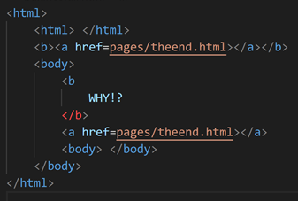

[Back to Portfolio](./)

 HTML Parser
===============

-   **Class: CSCI 315** 
-   **Grade: In Progress** 
-   **Language(s): C++** 
-   **Source Code Repository:** [ HTML Parser](https://github.com/JoeKauf/csci-315-spring-2022/tree/master/project2)  
    (Please [email me](mailto:example@csustudent.net?subject=GitHub%20Access) to request access.)

## Project description

This program takes in HTML files and parses them. After parsing it checks to see if pages are balanced and how many unique links are in each page. This program seeks to simulate webscraping.

## How to compile and run the program

```bash
cd ./Project2
make run
```

## UI Design

This program uses a command line UI. The program will take file input and output the information to the screen for the user to see.

An HTML file will be read into the file to be parsed (see Fig 1). Output lets the user know that the file is being parsed (see Fig 2). The balance and page count of the file will be output to the screen (see Fig 3).

  
Fig 1. HTML file to be parsed

  
Fig 2. File is being parsed

  
Fig 3. Parse results

## 3. Additional Considerations

This program only works for specific tags and is not capable of webscraping. However, algorithms in this program may be implemented into programs that utilize webscraping.


[Back to Portfolio](./)
