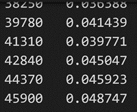
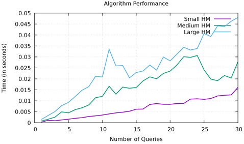

[Back to Portfolio](./)

Large Map
===============

-   **Class: CSCI 315** 
-   **Grade: In Progress** 
-   **Language(s): C++** 
-   **Source Code Repository:** [Large Map](https://github.com/JoeKauf/csci-315-spring-2022/tree/master/project1)  
    (Please [email me](mailto:jakaufman@csustudent.net?subject=GitHub%20Access) to request access.)

## Project description

This program is used to find a certain name from a file in an efficient amount of time. It takes input of around 50,000 first and last names. After this it outputs the time for finding a name's ID or how many instances a name's prefix there are.

## How to compile and run the program

Commands:

plot - compiles the program

data.out - outputs data from individual file to a file which will need to be renamed

mv data.out file.txt - renames data.out to the desired name

data.pdf - graphs the data from 3 renamed files. In order for this to work names must be renamed to "get.out", "mediumGet.out", "largeGet.out"

```bash
cd ./project1
make plot
make data.out
mv data.out newName.out
make data.pdf
```

Note: You will have to change the size in "file-helper2.cpp" to get different sizes to measure the graphs. Find line 12 and change X to a number 50,000 or less. The program must be recompiled three times to be able to plot for the three sizes.
```file-helper2.cpp
12 const int MAX_NAME_COUNT = X;
```


## UI Design

The user interface is a commandline interface which is operated by user makefile commands. The user generates a performance graph based upon the data that has been manipulated.

When the user enters the commands into the terminal (see Fig 1), the program runs behind the scenes. A text file is generated containing the timings for each size (see Fig 2). Once all of the timings have been created and appropriately named, the user can generate a graph (see Fig 3). Fig 4 displays the performance for finding a name's ID for sizes up to 50,000 names.

  
Fig 1. Command line

  
Fig 2. Data.out timings

  
Fig 3. Performance graph for finding number of names containing a prefix

  
Fig 4. Performance graph for finding a name and its associated ID

## 3. Additional Considerations

This program requires someone to be familiar with some C++ in order to manipulate data. Although the searching for names and getting IDs is Log(N), insertion is not.  

[Back to Portfolio](./)
