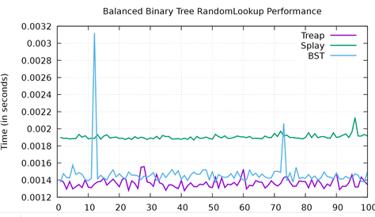

[Back to Portfolio](./)

Performance Comparison of Splay and Treap Trees
===============

-   **Class: CSCI 315** 
-   **Grade: In Progress** 
-   **Language(s): C++** 
-   **Source Code Repository:** [Performance Comparison of Splay and Treap Trees](https://github.com/JoeKauf/csci-315-spring-2022/tree/master/project3)  
    (Please [email me](mailto:jakaufman@csustudent.net?subject=GitHub%20Access) to request access.)

## Project description

This project visualizes and compares performance differences between two self-Balancing Binary Search Trees. Binary Search Trees are characterized by average case O(log2n) insert, remove, and searching times. However, in certain cases data can be input presorted. This causes the Binary Tree to resemble a linked list eliminating the added benefits of using a Binary Tree. 
	Self-balancing Binary Search Trees seek to mitigate worst case scenario and try to ensure a consistent Log(N) performance. This is achieved by sorting the data when a particular case is reached. This is typically when the height of the tree becomes imbalanced. As we will see, this is not always the case will see with Splay.

## How to compile and run the program

The user will run the "make plot" command to compile and create a "data.out" file containing information for one of the Binary Trees. The user will change which tree to plot each time by commenting it out and recompiling each time.

```main.cpp
29	// SplayTree<int> tree;
30	// Treap<int> tree;
31      BinaryTree<int> tree; // This will be used to make a Standard Binary Tree
```
Here is a list of commands that one can run using the makefile
```makefile
# Creates a file named data.out that can be renamed to specified file name
plot: src/main.cpp 
	g++ ${CPPFLAGS} src/main.cpp src/splay.cpp src/treap2.cpp src/BST.cpp -o main
	./main > data.out

#Creates the frequency pdf
frequency.pdf: splay.out treap2.out bst.out src/frequency.plot
	gnuplot src/frequency.plot
	rm splay.out 
	rm treap2.out 
	rm bst.out 

# Creates min and max performance
minMax.pdf: splay.out treap2.out bst.out src/min_max.plot
	gnuplot src/min_max.plot
	rm splay.out 
	rm treap2.out 
	rm bst.out 

# Creates random lookup performance
random.pdf: splay.out treap2.out bst.out src/randomlookup.plot
	gnuplot src/randomlookup.plot
	rm splay.out 
	rm treap2.out 
	rm bst.out 

# Creates performance graph for insert
insert.pdf: splay.out treap2.out src/insert.plot
	gnuplot src/insert.plot
	rm splay.out 
	rm treap2.out 

# Creates sequential performance graphs
sequential.pdf: splay.out treap2.out src/sequentialorder.plot
	gnuplot src/sequentialorder.plot
	rm splay.out 
	rm treap2.out 
```

```bash
cd ./project1
make plot

make *chosenname*.pdf
```


## UI Design

The user interface is a commandline interface which is operated by user makefile commands. The user generates a performance graph based upon the chosen algorithms.

  
Fig 1. Frequency Sort Performance

  
Fig 2. Random Lookup Performance


## Performance Analysis of Splay

  Splay trees are Binary search trees that keep the most recent elements towards the top of the tree. Every time insertion is called, the new item is placed at the root. Every time an element is looked up it is also placed at the root (Splay Trees). Therefore, more frequently accessed items will be towards the top. This makes it more efficient when items are more frequently accessed or input than others. This also compliments the cache which aids them in being faster than other structures with similar Big O Notation (Locality and Splay Trees). Since memory is slower than caching, if the lookup can be found in the cache it will be faster than an algorithm that looks to memory to access the information (Locality and Splay Trees).

## Performance Analysis of Treap

  Treap is a combination of binary trees and heaps. They take the key and a random priority for each element and organize the tree based off this information. This helps to mitigate the problem of presorted data being input. This randomization prevents the tree from becoming an O(N) traversal when input in ascending order (Definition: Splay Tree). Treaps seek to prevent this and make it more probable that the look up will be Log(N)(Treap). They do this through setting a priority on nodes, replicating randomness for each insertion. This create a greater likelihood that the insertion will be Log(N).


## Additional Considerations

  This Project helps in understanding differences between data structures with comparable Big O Notations. Splaying’s biggest advantage comes when data has certain frequencies to it. Treaps are faster regarding randomized data. When standard Binary Search Trees utilize random operations, they are slightly faster in due to not having calculate priority or rebalance as with inputted data. 
  Splaying theoretically should be faster than Treap and Binary Search Trees due to the utilization of caching. This is because memory lookup is slower than caching. When data is organized in a specific way, it complements the cache. [More about my Analysis.](https://github.com/JoeKauf/csci-315-spring-2022/blob/master/project3/Performance%20Comparison%20of%20Splay%20and%20Treap%20Trees.docx)

## Sources

“Definition: Splay Tree.” Educative, https://www.educative.io/edpresso/definition-splay-tree . 
“Locality and Splay Trees.” Cornell, 2007, https://www.cs.cornell.edu/courses/cs312/2007sp/lectures/lec24.html. 
Nair, KK. “TREAP Data Structure.” Techie Delight, 30 Apr. 2021, https://www.techiedelight.com/treap-data-structure/. 
“Splay Trees.” Cornell, 2013, https://www.cs.cornell.edu/courses/cs3110/2013sp/recitations/rec08-splay/rec08.html. 
Taylor. “Randomness.” USNA, https://www.usna.edu/Users/cs/taylor/courses/ic312/units/treap/treap.html. 
“Treap (Cartesian Tree).” Treap (Cartesian Tree) - Algorithms for Competitive Programming, https://cp-algorithms.com/data_structures/treap.html. 
“Treap.” Gnarley Trees, https://people.ksp.sk/~kuko/gnarley-trees/Treap.html. 


[Back to Portfolio](./)
