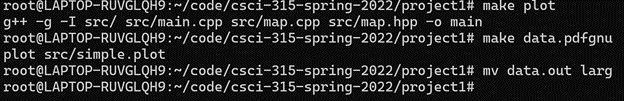
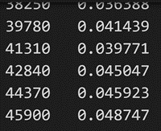
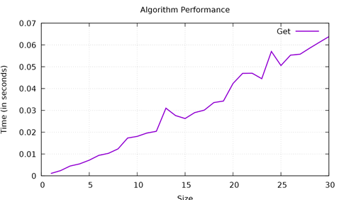

[Back to Portfolio](./)

Large Map
===============

-   **Class: CSCI 315** 
-   **Grade: In Progress** 
-   **Language(s): C++** 
-   **Source Code Repository:** [Large Map](https://github.com/JoeKauf/csci-315-spring-2022/tree/master/project3)  
    (Please [email me](mailto:jakaufman@csustudent.net?subject=GitHub%20Access) to request access.)

## Project description

This project visualizes and compares performance differences between two self-Balancing Binary Search Trees. Binary Search Trees are characterized by average case O(log2n) insert, remove, and searching times. However, in certain cases data can be input presorted. This causes the Binary Tree to resemble a linked list eliminating the added benefits of using a Binary Tree. 

	Self-balancing Binary Search Trees seek to mitigate worst case scenario and try to ensure a consistent Log(N) performance. This is achieved by sorting the data when a particular case is reached. This is typically when the height of the tree becomes imbalanced. As we will see, this is not always the case will see with Splay.

## How to compile and run the program

Commands:

plot - compiles the program

data.out - outputs data from individual file to a file which will need to be renamed

mv data.out file.txt - renames data.out to the desired name

data.pdf - graphs the data from 3 renamed files. In order for this to work names must be renamed to "get.out", "mediumGet.out", "largeGet.out"

```bash
cd ./project1
make plot
make data.out
mv data.out newName.out
make data.pdf
```

Note: You will have to change the size in "file-helper2.cpp" to get different sizes to measure the graphs. Find line 12 and change X to a number 50,000 or less. The program must be recompiled three times to be able to plot for the three sizes.
```file-helper2.cpp
12 const int MAX_NAME_COUNT = X;
```


## UI Design

The user interface is a commandline interface which is operated by user makefile commands. The user generates a performance graph based upon the data that has been manipulated.

When the user enters the commands into the terminal (see Fig 1), the program runs behind the scenes. A text file is generated containing the timings for each size (see Fig 2). Once all of the timings have been created and appropriately named, the user can generate a graph (see Fig 3). Fig 4 displays the performance for finding a name's ID for sizes up to 50,000 names.

  
Fig 1. Command line

  
Fig 2. Data.out timings

  
Fig 3. Performance graph for finding number of names containing a prefix

  
Fig 4. Performance graph for finding a name and its associated ID

## Performance Analysis of Splay

  Splay trees are Binary search trees that keep the most recent elements towards the top of the tree. Every time insertion is called, the new item is placed at the root. Every time an element is looked up it is also placed at the root (Splay Trees). Therefore, more frequently accessed items will be towards the top. This makes it more efficient when items are more frequently accessed or input than others. This also compliments the cache which aids them in being faster than other structures with similar Big O Notation (Locality and Splay Trees). Since memory is slower than caching, if the lookup can be found in the cache it will be faster than an algorithm that looks to memory to access the information (Locality and Splay Trees).

## Performance Analysis of Treap

  Treap is a combination of binary trees and heaps. They take the key and a random priority for each element and organize the tree based off this information. This helps to mitigate the problem of presorted data being input. This randomization prevents the tree from becoming an O(N) traversal when input in ascending order (Definition: Splay Tree). Treaps seek to prevent this and make it more probable that the look up will be Log(N)(Treap). They do this through setting a priority on nodes, replicating randomness for each insertion. This create a greater likelihood that the insertion will be Log(N).


## Additional Considerations

  This Project helps in understanding differences between data structures with comparable Big O Notations. Splaying’s biggest advantage comes when data has certain frequencies to it. Treaps are faster regarding randomized data. When standard Binary Search Trees utilize random operations, they are slightly faster in due to not having calculate priority or rebalance as with inputted data. 
  Splaying theoretically should be faster than Treap and Binary Search Trees due to the utilization of caching. This is because memory lookup is slower than caching. When data is organized in a specific way, it complements the cache. [Here is more about my analysis] (https://github.com/JoeKauf/csci-315-spring-2022/blob/master/project3/Performance%20Comparison%20of%20Splay%20and%20Treap%20Trees.docx)

## Performance Plots

[Back to Portfolio](./)
