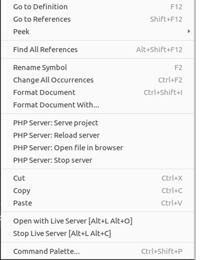
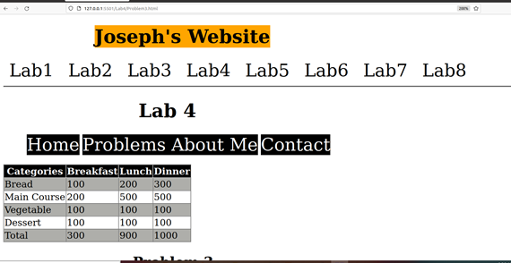
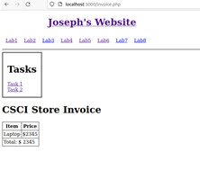

[Back to Portfolio](./)

Applied Networking Website
===============

-   **Class: CSCI 315** 
-   **Grade: A** 
-   **Language(s): HTML, CSS, and PHP** 
-   **Source Code Repository:** [Applied Networking Website](https://github.com/JoeKauf/Applied-Netowrking-Website)  
    (Please [email me](mailto:jakaufman@csustudent.net?subject=GitHub%20Access) to request access.)

## Project description

Using this website I learned how to create forms, websites, use arrays in PHP, create CSS tables, and take input from users. I also learned how to create a store, display images, use PHP Get and Post, and use links. CSS was used for styling the tables, navbars, and underlying HTML.

## How to compile and run the program

In VS Code download the extension "Live Server". Once you have downloaded Live Server, right click on the index page at the front of the folder. In the drop down click "Open with Live Server". This will open up the server in your browser. From there you can access each page and navigate using the nav bar. For the PHP portion you will need to 

  
Fig 1. Live Server dropdown

## UI Design

The UI is displayed in a web browser. Some of it is mainly HTML, but other parts of the project is PHP and CSS. Below are some screenshots of what it looks like:

  
Fig 1. Website with simple navbar

  
Fig 2. Basic Table

  
Fig 3. CSS page with table and dropdown menu

  
Fig 4. PHP store with one item selected

  
Fig 5. PHP store after calculating total

## Performance Analysis of Splay

  Splay trees are Binary search trees that keep the most recent elements towards the top of the tree. Every time insertion is called, the new item is placed at the root. Every time an element is looked up it is also placed at the root (Splay Trees). Therefore, more frequently accessed items will be towards the top. This makes it more efficient when items are more frequently accessed or input than others. This also compliments the cache which aids them in being faster than other structures with similar Big O Notation (Locality and Splay Trees). Since memory is slower than caching, if the lookup can be found in the cache it will be faster than an algorithm that looks to memory to access the information (Locality and Splay Trees).

## Performance Analysis of Treap

  Treap is a combination of binary trees and heaps. They take the key and a random priority for each element and organize the tree based off this information. This helps to mitigate the problem of presorted data being input. This randomization prevents the tree from becoming an O(N) traversal when input in ascending order (Definition: Splay Tree). Treaps seek to prevent this and make it more probable that the look up will be Log(N)(Treap). They do this through setting a priority on nodes, replicating randomness for each insertion. This create a greater likelihood that the insertion will be Log(N).

## Additional Considerations

  This Project helps in understanding differences between data structures with comparable Big O Notations. Splaying’s biggest advantage comes when data has certain frequencies to it. Treaps are faster regarding randomized data. When standard Binary Search Trees utilize random operations, they are slightly faster in due to not having calculate priority or rebalance as with inputted data. 
  Splaying theoretically should be faster than Treap and Binary Search Trees due to the utilization of caching. This is because memory lookup is slower than caching. When data is organized in a specific way, it complements the cache. [More about my Analysis.](https://github.com/JoeKauf/csci-315-spring-2022/blob/master/project3/Performance%20Comparison%20of%20Splay%20and%20Treap%20Trees.docx)

## Sources

“Definition: Splay Tree.” Educative, https://www.educative.io/edpresso/definition-splay-tree . 
“Locality and Splay Trees.” Cornell, 2007, https://www.cs.cornell.edu/courses/cs312/2007sp/lectures/lec24.html. 
Nair, KK. “TREAP Data Structure.” Techie Delight, 30 Apr. 2021, https://www.techiedelight.com/treap-data-structure/. 
“Splay Trees.” Cornell, 2013, https://www.cs.cornell.edu/courses/cs3110/2013sp/recitations/rec08-splay/rec08.html. 
Taylor. “Randomness.” USNA, https://www.usna.edu/Users/cs/taylor/courses/ic312/units/treap/treap.html. 
“Treap (Cartesian Tree).” Treap (Cartesian Tree) - Algorithms for Competitive Programming, https://cp-algorithms.com/data_structures/treap.html. 
“Treap.” Gnarley Trees, https://people.ksp.sk/~kuko/gnarley-trees/Treap.html. 

[Back to Portfolio](./)
