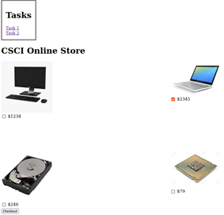

[Back to Portfolio](./)

Applied Networking Website
===============

-   **Class: CSCI 315** 
-   **Grade: A** 
-   **Language(s): HTML, CSS, and PHP** 
-   **Source Code Repository:** [Applied Networking Website](https://github.com/JoeKauf/Applied-Netowrking-Website)  
    (Please [email me](mailto:jakaufman@csustudent.net?subject=GitHub%20Access) to request access.)

## Project description

Using this website I learned how to create forms, websites, use arrays in PHP, create CSS tables, and take input from users. I also learned how to create a store, display images, use PHP Get and Post, and use links. CSS was used for styling the tables, navbars, and underlying HTML.

## How to compile and run the program

In VS Code download the extension "Live Server". Once you have downloaded Live Server, right click on the index page at the front of the folder. In the drop down click "Open with Live Server". This will open up the server in your browser. From there you can access each page and navigate using the nav bar. 

For the files that end in ".php", you will need to click "PHP Server: Serve project". This will allow the PHP to be run and not just the HTML.

  
Live Server and PHP Server dropdowns

## UI Design

The UI is displayed in a web browser. An HTML navbar with basic anchor tags can be seen in Fig 1. A basic HTML Table is exhibited in Fig2. In Fig 3, there is a CSS page that contains a dropdown menu for the problems and a formatted table using CSS. This project also implements PHP which is exhibited in the store. This is exhibited by when the user calculates their total for the store, it is all on the same page (Fig 4, 5).

  
Fig 1. Website with simple navbar

  
Fig 2. Basic Table

  
Fig 3. CSS page with table and dropdown menu

  
Fig 4. PHP store with one item selected

  
Fig 5. PHP store after calculating total

## Additional Considerations

[Back to Portfolio](./)
