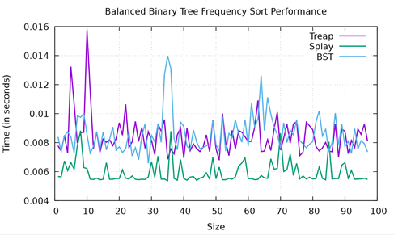

Portfolio
=========

Programming Projects
--------------------

*For access to my private project repositories, please [email me](mailto:josephandrewkaufman@gmail.com?subject=GitHub%20Access) with the subject line, GitHub Access.

---
### [Restaurant Menu | CSCI 325](project1)

---
### [HTML Parser | CSCI 315](Project2)

---
### [Large Map | CSCI 315](Project3)

---
### [Performance Comparison of Treap and Splay Trees | CSCI 315](Project4)

---

Ethics Papers
-------------

### [Testing and Therac-25](/pdf/CSCI315 Ethics Paper Joseph Kaufman (1).docx)

-   **Class: CSCI 315 Data Structures Analysis**  
-   **Grade: In Progress**

### [Ethics of Rushing Code to Market](/pdf/CSCI 325 Ethics Paper JAKaufman.docx)

-   **Class: CSCI 325 Object Oriented Programming** 
-   **Grade: A**

### [Copyright Ethics](pdf/SofSL Copyright Ethics Paper.pdf)

-   **Class: CSCI 301 Survey of Scripting Languages** 
-   **Grade: A**

---

Presentations
-------------

### [UFO Hacker](pdf/Sample CSCI 301 (2).pdf)

- **Class: CSCI 301** 
- **Grade: A**

### [Restaurant Menu Presentation](images/Restaurant Menu.mp4)

- **Class: CSCI 325** 
- **Grade: A**

---

