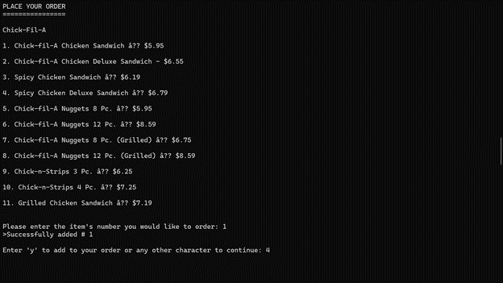
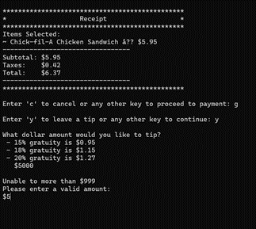
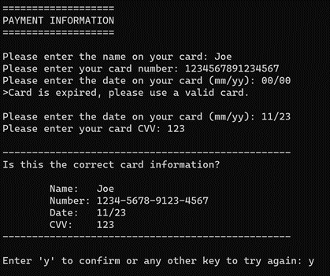

[Back to Portfolio](./)

Restaurant Menu
===============

-   **Class: CSCI 325** 
-   **Grade: A** 
-   **Language(s): Java** 
-   **Group Members: Jared Andraszek, Jaye Engelhardt, Logan Ferguson, Joseph Kaufman, and Myles O’Toole**
-   **Source Code Repository:** [Restaurant Menu](https://github.com/JoeKauf/CSCIRestaurantMenu/tree/main/RestarauntMenu)  
    (Please [email me](mailto:jakaufman@csustudent.net?subject=GitHub%20Access) to request access.)

## Project description

This program generates a food menu from some popular restaurants for the user to choose from. The user can choose where they would like to eat and choose their items. After this, they will head to checkout and pay for their items. Once completed the user will have the option to leave a review. 


## How to compile and run the program

How to compile (if applicable) and run the project.

```bash
cd \csci325-Restaurant-menu-master\csci325-Restaurant-menu-master\RestarauntMenu

java -cp ./src csu.csci325.RestarauntMenu
```

Note: the class files are already included in the repo so they do not need to be compiled using "javac".

## UI Design

This program uses a command line interface. The program outputs a menu and the user will interact with it by entering in responses based upon the screen's prompts.

User is prompted to select between three menus (see Fig 1). Then the screen displays the options for the user to order (see Fig 2). After the user has made all of the selections, they now can see their tip (see Fig 3). Finally the user can input payment information (see Fig 4).

  
Fig 1. User is prompted to choose a menu.

  
Fig 2. User order screen.

  
Fig 3. Receipt is output.

  
Fig 4. Make payment screen.

## 3. Additional Considerations

This program is a group project and not all of it was mine own. The majority of my role here was project management and project requirements for the team. Additionally, I was responsible for making the receipt and tip prompt.

[Back to Portfolio](./)
